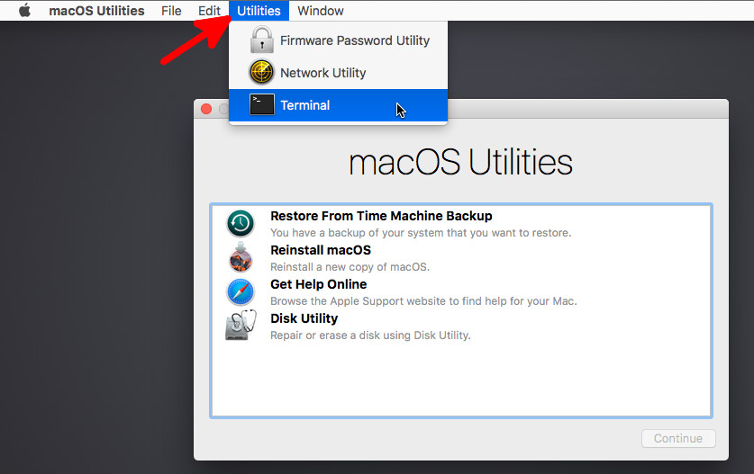
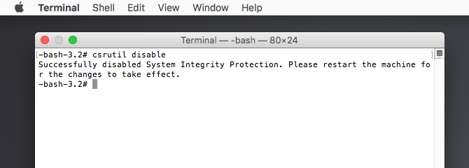

# Ruby.framework 2.0
This version of Ruby was removed after the Yosemite update.

Download the contents of this repository: 
[Download](https://github.com/iosdec/Ruby.framework-2.0/archive/master.zip)

# Disabling SIP

We must disable System Integrity Protection before we continue.. 
this will allow us to modify folders under /System. 
To do this, power down the your Mac and hold CMD+R as the Mac is 
powering on, this will bring you into recovery mode.

Now you're in recovery mode, you need to open up a Terminal: 

Disable SIP by entering the following command: 
*csrutil disable*

You should be presented with the following message: 

Now restart your Mac by clicking the Apple logo at the top left, 
then Restart. SIP should now have been disabled.

# Installation
Now open up a Finder window and head to: 
*/System/Library/Frameworks/Ruby.framework/Versions*

Copy the 2.0 folder from Ruby.framework/Versions/ 
downloaded from this repo to the path above.

Finally re-enable SIP by going into recovery mode and entering 
*csrutil enable*

Done!
